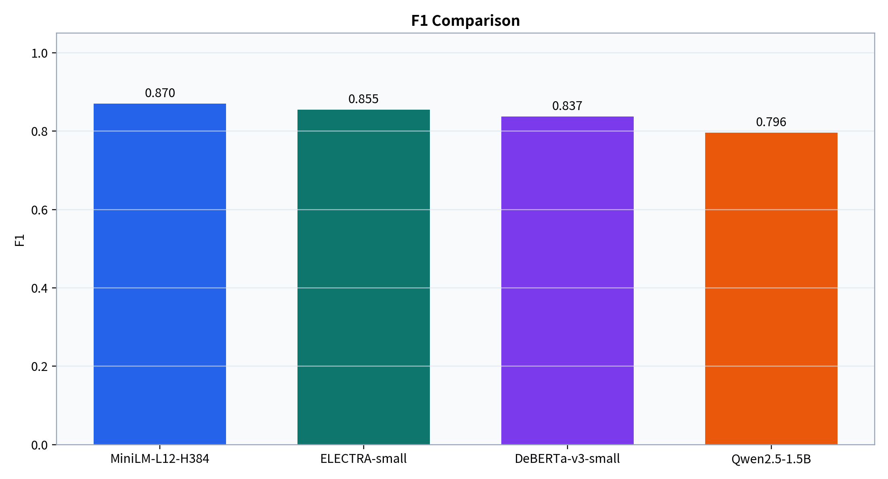
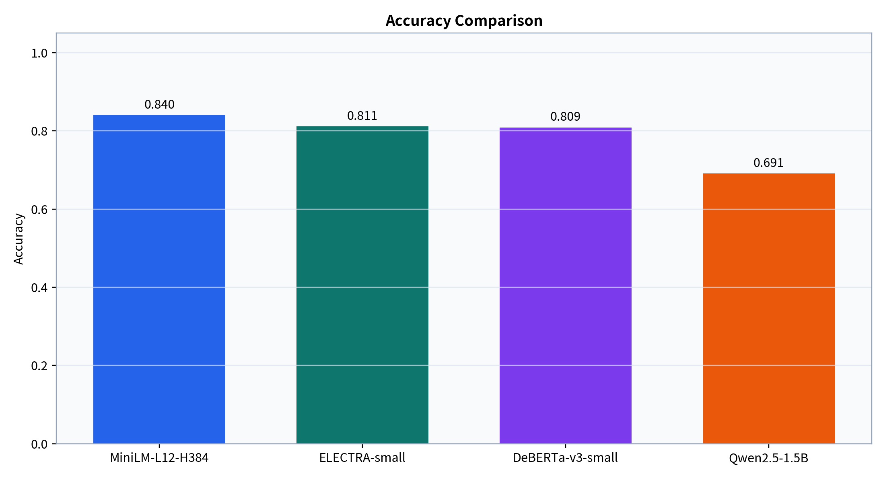
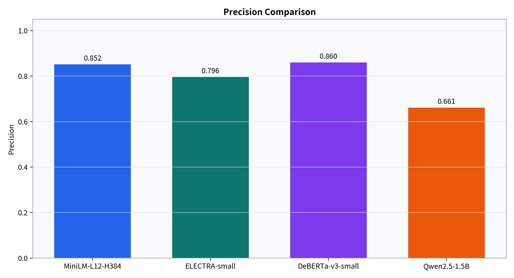
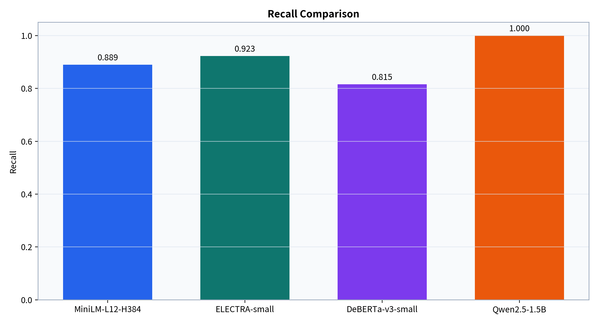
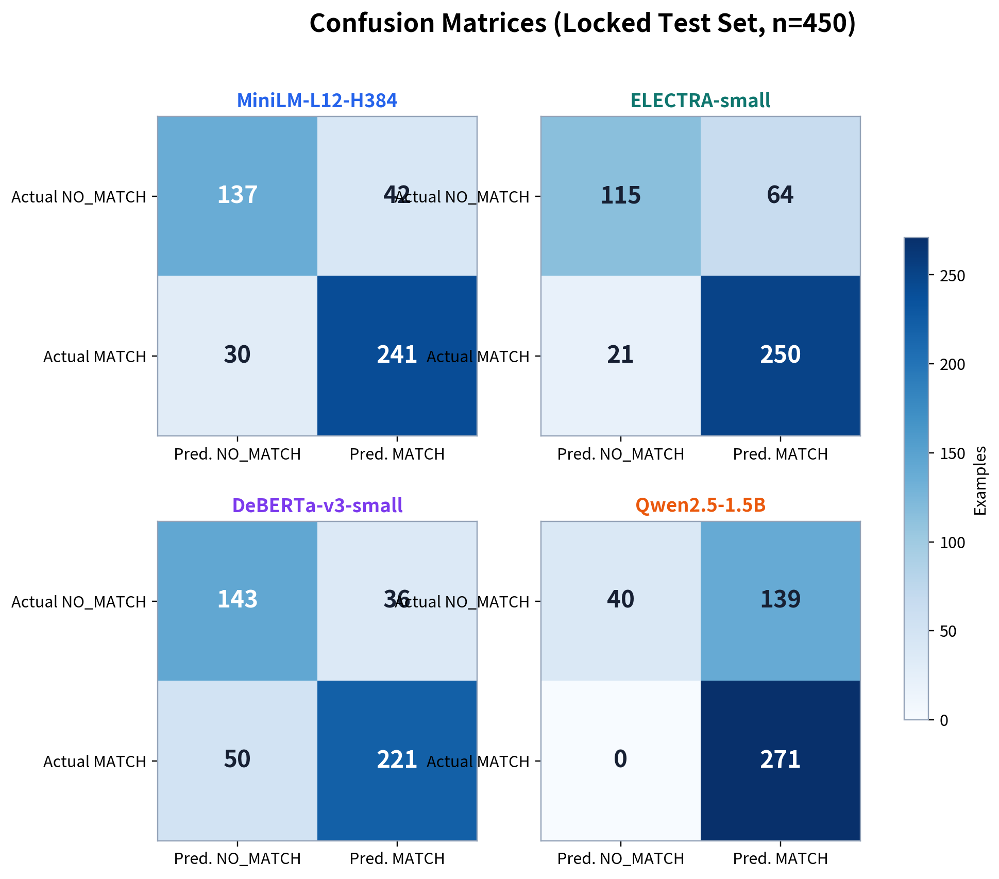
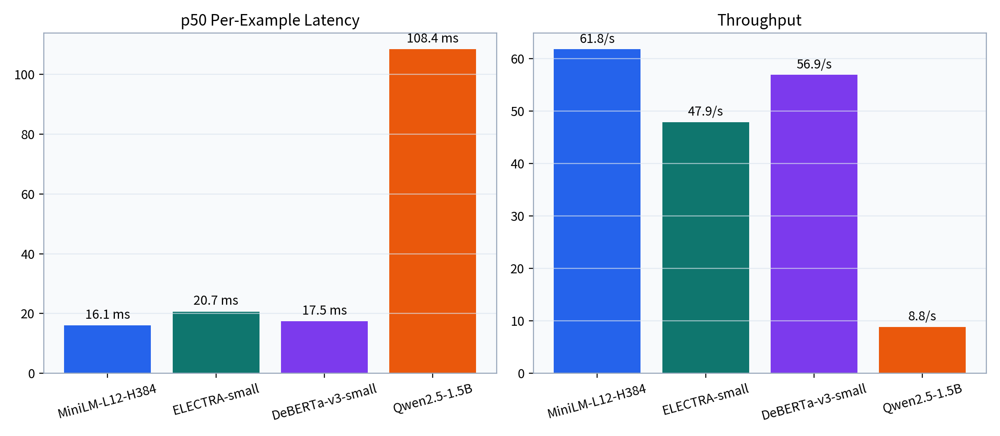
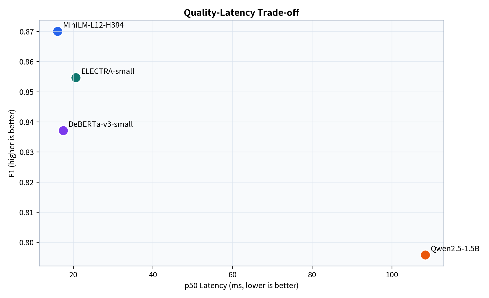

# Detailed Four-Model GPU Place-Matching Experiment Report

> Report type: Technical review  
> Generated: 2026-07-21  
> Hardware: NVIDIA RTX A6000  
> Sources: four per-example prediction files, consolidated metrics, and run metadata

[TOC]

## Executive Summary

This experiment evaluates small models for a binary place-matching task: determining whether two Overture-style place records refer to the same real-world entity. The work replaces a notebook-only workflow and addresses material credibility issues in the legacy evaluation, including ineffective field removal, reversed false-positive/false-negative bookkeeping, and the risk of entity leakage from random row-level splitting.

The audit began with 3000 rows. After removing 3 duplicate pairs, 2997 rows remained. Entity-connected components were assigned to 2098 training, 449 validation, and 450 test examples. Three supervised encoders and one zero-shot generative model were evaluated on the same locked 450-example test set.

The primary metric winner was **MiniLM-L12-H384 with F1 0.8700 (95% CI [0.8429, 0.8948])**. It also achieved the best Accuracy and MCC and the lowest p50 latency. Qwen reached 100% Recall, but generated 139 false positives, revealing a strong MATCH bias. The practical conclusion is that a fine-tuned encoder is a better default for this task than direct zero-shot generation.

## 1. Changes Made in This Work

### 1.1 Reproducible experiment framework

- Replaced notebook-bound training and evaluation with a configuration-driven `benchmark` CLI.
- Added explicit stages for data validation, grouped splitting, encoder training, prompt inference, evaluation, and report generation.
- Persisted every test prediction together with raw output or score, token counts, validity, and synchronized GPU latency.
- Recorded package versions, GPU, Git revision, Hugging Face model revision, random seed, configuration, and peak GPU memory.
- Generated all tables and figures from prediction artifacts rather than manually maintained metric arrays.

### 1.2 Credibility fixes

1. **Metric orientation:** removed handwritten confusion-matrix bookkeeping and standardized Accuracy, Precision, Recall, F1, Balanced Accuracy, MCC, TP, TN, FP, and FN on `sklearn`.
2. **Input leakage:** the serializer explicitly includes names, categories, websites, social accounts, email, phone, brand, and address. `sources`, `confidence`, `id`, and `base_id` never enter model text.
3. **Entity leakage:** `id` and `base_id` form an entity graph; connected components are assigned as groups so an entity cannot cross train, validation, and test splits.
4. **Locked test set:** learning-rate and prompt decisions use training/validation data only. Test labels are used once after the best checkpoint is selected.
5. **Environment portability:** removed absolute Colab paths, hard-coded model output paths, unconditional BF16, and tokenizer assumptions tied to one model.
6. **Legacy isolation:** old notebook results remain for provenance but are marked historical and unverifiable. They do not appear on the new leaderboard.

### 1.3 DeBERTa numerical-stability fix

Under Transformers 5.14.1, the DeBERTa checkpoint was materialized with FP16 parameters even after trainer mixed precision was disabled. AdamW produced non-finite parameters after its first update. Explicitly loading the model with `dtype=torch.float32` kept all parameters finite over a 20-step diagnostic and throughout the formal run. This compatibility fix changes neither data nor labels.

## 2. Experiment Framework

```text
Read-only Parquet → audit/deduplicate → entity graph → grouped 70/15/15 split
                                           ↓
Explicit serialization → encoder fine-tuning ─┬→ locked test predictions
                         Qwen zero-shot ───────┘
                                           ↓
sklearn metrics → 1,000 stratified bootstraps → CSV / figures / reports
```

### 2.1 Data and leakage prevention

| Split | Examples | Positives | Positive rate |
|---|---:|---:|---:|
| Train | 2098 | 1267 | 60.39% |
| Validation | 449 | 271 | 60.36% |
| Test | 450 | 271 | 60.22% |

Because the test set is 60.22% positive, Accuracy alone can obscure class bias. F1, Balanced Accuracy, MCC, and the full confusion matrix are therefore reported together.

### 2.2 Evaluation tracks and configuration

- **Supervised encoders:** ELECTRA, MiniLM, and DeBERTa use `AutoModelForSequenceClassification(num_labels=2)` with full fine-tuning, maximum length 256, batch size 32, weight decay 0.01, at most 10 epochs, and validation-F1 early stopping with patience 2. Each compares learning rates `2e-5` and `5e-5`; the formal run uses seed 42.
- **Prompt inference:** Qwen2.5-1.5B-Instruct uses its official chat template, zero-shot prompting, deterministic decoding, and at most four generated tokens. Only exact `MATCH` or `NO_MATCH` outputs are valid.

| Model | Track / regime | Best LR | Precision mode | Model revision |
|---|---|---:|---|---|
| MiniLM-L12-H384 | Encoder / fine-tuned | 5e-05 | BF16 | `44acabbec0ef` |
| ELECTRA-small | Encoder / fine-tuned | 5e-05 | BF16 | `fa8239aadc09` |
| DeBERTa-v3-small | Encoder / fine-tuned | 2e-05 | FP32 | `a36c739020e0` |
| Qwen2.5-1.5B | Prompt / zero-shot | — | BF16 inference | `989aa7980e4c` |

## 3. Results

### 3.1 Overall predictive quality

| Model | Accuracy | Precision | Recall | F1 | F1 95% CI | Balanced Acc. | MCC |
|---|---:|---:|---:|---:|---:|---:|---:|
| MiniLM-L12-H384 | 0.8400 | 0.8516 | 0.8893 | **0.8700** | [0.8429, 0.8948] | 0.8273 | 0.6632 |
| ELECTRA-small | 0.8111 | 0.7962 | 0.9225 | **0.8547** | [0.8322, 0.8793] | 0.7825 | 0.6021 |
| DeBERTa-v3-small | 0.8089 | 0.8599 | 0.8155 | **0.8371** | [0.8039, 0.8672] | 0.8072 | 0.6076 |
| Qwen2.5-1.5B | 0.6911 | 0.6610 | 1.0000 | **0.7959** | [0.7844, 0.8102] | 0.6117 | 0.3843 |



MiniLM leads ELECTRA by 0.0153 F1 and DeBERTa by 0.0329. The encoder bootstrap intervals overlap, so this single-seed experiment supports MiniLM as the best current candidate but does not prove a stable architecture-level difference.







### 3.2 Confusion matrices and error profiles

| Model | TN | FP | FN | TP | Valid n | Invalid rate |
|---|---:|---:|---:|---:|---:|---:|
| MiniLM-L12-H384 | 137 | 42 | 30 | 241 | 450 | 0.00% |
| ELECTRA-small | 115 | 64 | 21 | 250 | 450 | 0.00% |
| DeBERTa-v3-small | 143 | 36 | 50 | 221 | 450 | 0.00% |
| Qwen2.5-1.5B | 40 | 139 | 0 | 271 | 450 | 0.00% |



- **MiniLM:** 42 FP and 30 FN provide the most balanced error profile; its MCC of 0.6632 is the highest of all four models.
- **ELECTRA:** Recall is 0.9225, with only 21 missed matches, but 64 false positives. It fits recall-first candidate generation followed by review.
- **DeBERTa:** Precision is 0.8599, the highest in the benchmark, and FP falls to 36. The trade-off is 50 false negatives, making it attractive when false merges are especially costly.
- **Qwen:** all 271 positives are recovered, but 139 negatives are incorrectly labeled MATCH. Balanced Accuracy is only 0.6117, so the model is biased rather than balanced.

### 3.3 Latency, throughput, and resources

| Model | p50 (ms) | p95 (ms) | Throughput (/s) | Avg. input tokens | Avg. output tokens | Peak VRAM (MiB) |
|---|---:|---:|---:|---:|---:|---:|
| MiniLM-L12-H384 | 16.07 | 17.13 | 61.79 | 255.53 | 0.00 | 147.64 |
| ELECTRA-small | 20.67 | 22.70 | 47.91 | 255.53 | 0.00 | 69.71 |
| DeBERTa-v3-small | 17.46 | 18.15 | 56.91 | 256.00 | 0.00 | 591.64 |
| Qwen2.5-1.5B | 108.42 | 158.43 | 8.84 | 338.50 | 2.09 | 2999.87 |



Encoder p50 latency ranges from 16.07 to 20.67 ms, compared with 108.42 ms for Qwen. MiniLM combines the best F1 with the lowest p50 latency. Qwen is approximately 6.7 times slower and peaks near 2.93 GiB of GPU memory.



## 4. Interpretation and Model Recommendations

1. **Default deployment candidate — MiniLM.** It leads F1, Accuracy, and MCC while delivering the lowest latency.
2. **Recall-first candidate — ELECTRA.** It is appropriate when missed true matches are more costly and downstream review can absorb extra false positives.
3. **Precision-first candidate — DeBERTa.** Its low false-positive count is useful when an incorrect merge can contaminate a master dataset, at the cost of more missed matches and FP32 training.
4. **Do not use zero-shot Qwen as an autonomous merger.** Its F1 can look acceptable despite substantial MATCH bias. It may serve as a high-recall candidate generator or auxiliary signal behind rules or an encoder.

## 5. Credibility, Limitations, and Interpretation Boundaries

### 5.1 Safeguards completed

- Comparable runs share one split, serializer, maximum length, selection metric, and timing method.
- Every test result traces to 450 per-example predictions; confusion totals match the valid prediction count.
- Confidence intervals use 1,000 stratified bootstrap resamples of locked test predictions.
- Qwen parsing is strict and its invalid-output rate is 0.00%; no output is manually corrected.
- Local resource measurements and hosted API prices are kept separate. No unverifiable dollar estimate is reported.

### 5.2 Limitations

- Each encoder has only seed 42, so the benchmark does not yet estimate three-seed training variance.
- No field ablation was run; this experiment cannot isolate the contribution of email, website, address, brand, or category.
- Qwen was evaluated zero-shot only; fixed three-shot prompting, calibration, and fine-tuning remain untested.
- Llama 3.2 and Gemma 2 were intentionally skipped because they require gated Hugging Face access.
- The test set contains 450 examples from one source. Generalization across geography, language, and place category needs external validation.
- Timing reflects batch size 1 on one RTX A6000 and does not predict CPU, other-GPU, or batched deployment performance.

## 6. Reproduction

```bash
python -m venv .venv
source .venv/bin/activate
pip install -e '.[dev,report]'

benchmark validate-data
benchmark train-encoder --model google/electra-small-discriminator --scenario full --seed 42
benchmark train-encoder --model microsoft/MiniLM-L12-H384-uncased --scenario full --seed 42
benchmark train-encoder --model microsoft/deberta-v3-small --scenario full --seed 42
benchmark run-prompt --model Qwen/Qwen2.5-1.5B-Instruct --regime zero --scenario full
benchmark report
python scripts/build_experiment_report.py
```

Model caches, checkpoints, and virtual environments remain excluded from version control. The committed predictions, metadata, split manifest, and aggregate tables are sufficient to trace every value in this report.

## 7. Conclusion

This work adds a four-model GPU benchmark and corrects evaluation defects that could systematically distort earlier conclusions. On the locked test set, MiniLM offers the strongest quality-efficiency balance; ELECTRA and DeBERTa provide recall-first and precision-first alternatives; zero-shot Qwen exhibits a material MATCH bias. The most valuable next steps are three-seed encoder runs, field ablations, and fixed three-shot Qwen evaluation to test ranking stability and feature dependence.

---

Sources: `artifacts/reports/run_metrics.csv`, four `predictions.csv` files, four `metadata.json` files, and `artifacts/data_audit.json`. This report and its figures are generated by `scripts/build_experiment_report.py`.
