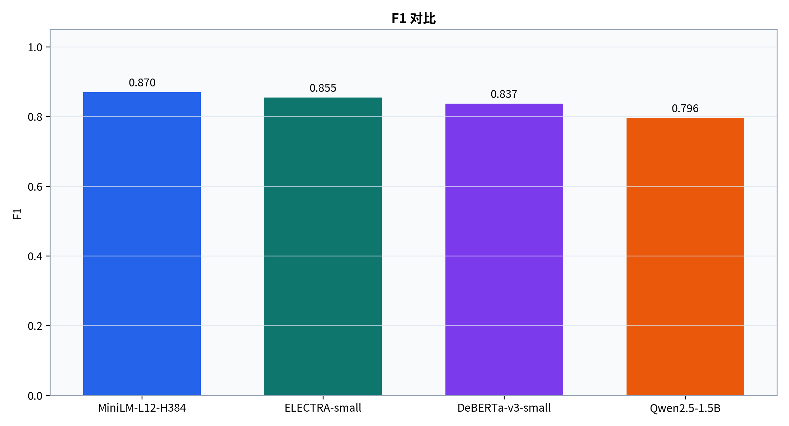
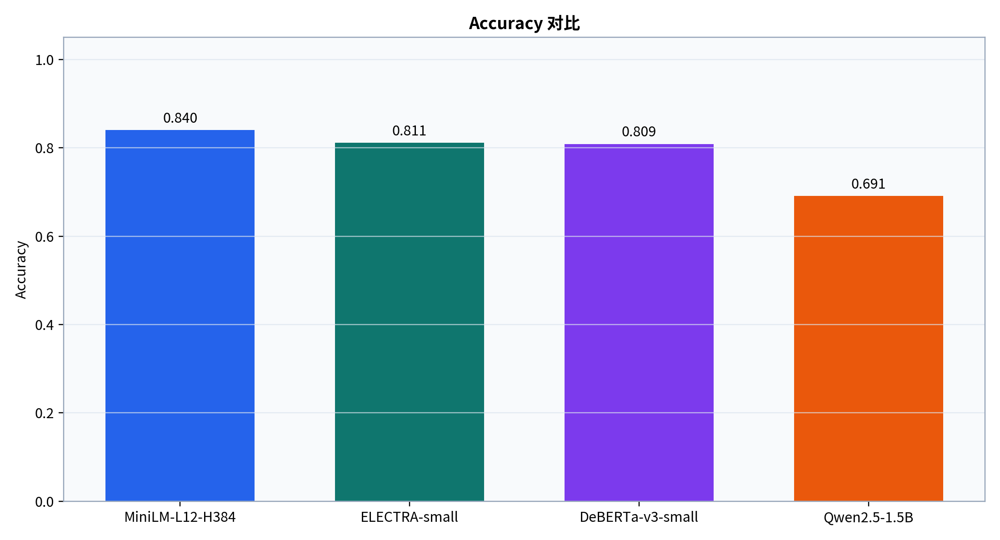
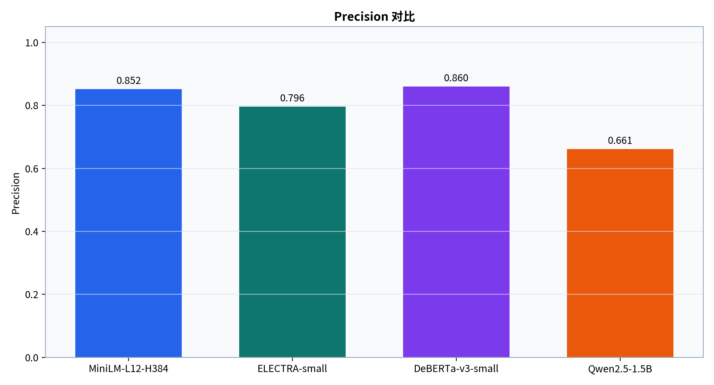
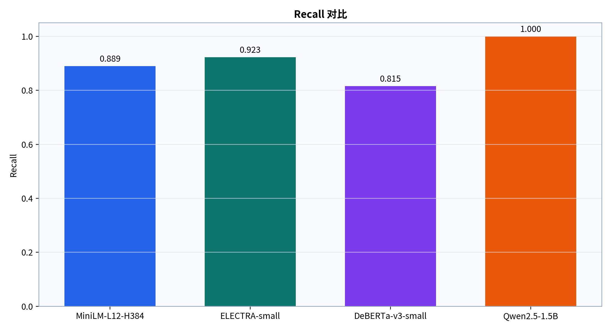
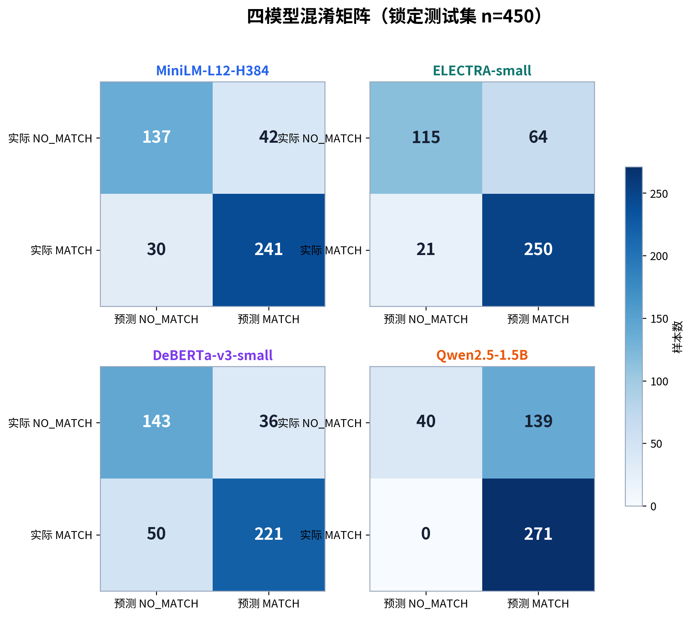
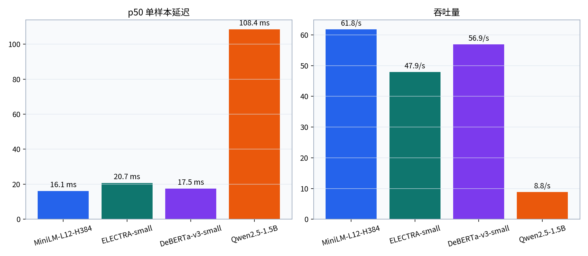
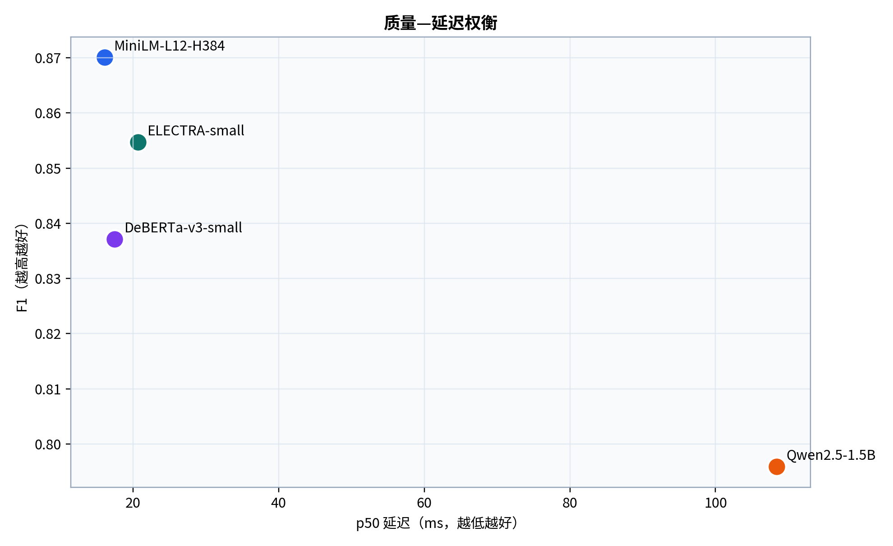

# 四模型 GPU 地点匹配实验详细报告

> 报告类型：中文技术评审报告  
> 生成日期：2026-07-21  
> 硬件：NVIDIA RTX A6000  
> 数据来源：四份逐样本预测、统一指标汇总和模型运行 metadata

[TOC]

## 摘要

本实验面向 Overture 风格地点记录的二分类匹配任务：判断两条地点记录是否指向同一现实实体。为修复原 Notebook 中字段删除无效、FP/FN 记账对调及随机切分可能造成实体泄漏等可信度问题，本次将流程重构为配置驱动 CLI，并在统一、锁定的数据切分上完成三个 Encoder 微调实验和一个小型生成模型 zero-shot 实验。

共审计 3000 条原始样本，去除 3 条重复后保留 2997 条；按实体连通分量划分为训练 2098、验证 449、测试 450 条。四个模型均在同一 450 条测试集上评估。主指标 F1 最优模型为 **MiniLM-L12-H384（0.8700，95% CI [0.8429, 0.8948]）**。

核心工程结论是：监督 Encoder 在本任务上优于直接 zero-shot 生成推理；MiniLM 同时取得最高 Accuracy、F1 和 MCC，并具有最低 p50 延迟。Qwen 达到 100% Recall，但以 139 个假阳性为代价，不能仅凭 F1 将其视为稳健的实体合并器。

## 1. 本次改动

### 1.1 从 Notebook 到可复现实验框架

- 将数据审计、切分、Encoder 训练、提示推理、评估与报告整理为统一 `benchmark` CLI。
- 所有实验由配置、模型 ID、场景、随机种子和 regime 明确标识；逐样本保存预测、原始输出、token 与延迟。
- 保存 Python、PyTorch、Transformers、CUDA/GPU、Git revision 与 Hugging Face 模型 revision。
- 可视化只从预测和汇总 CSV 生成，不在 Notebook 或报告中维护独立指标数组。

### 1.2 影响结论可信度的问题修复

1. **指标方向修复**：删除原先手工且对调 FP/FN 的逻辑，统一由 `sklearn` 计算混淆矩阵、Precision、Recall、F1、Balanced Accuracy 与 MCC。
2. **输入泄漏修复**：通过序列化器显式选择名称、类别、网站、社交账号、邮箱、电话、品牌和地址；`sources`、`confidence`、`id`、`base_id` 不进入模型文本。
3. **实体泄漏修复**：用 `id`/`base_id` 建立关系图，按连通分量分组切分，确保同一实体 ID 不跨训练、验证和测试集合。
4. **测试集锁定**：提示选择和学习率选择仅使用训练/验证数据；测试集只在最佳 checkpoint 确定后评估。
5. **环境兼容修复**：移除绝对 Colab 路径、硬编码保存位置、无条件 BF16 和模型专属 tokenizer 假设。
6. **历史结果隔离**：原 Notebook 结果保留用于溯源，但标为历史且不可验证，不进入新排行榜。

### 1.3 DeBERTa 数值稳定性修复

在当前 Transformers 5.14.1 环境中，DeBERTa checkpoint 的参数实际被物化为 FP16，即使训练器混合精度已关闭，AdamW 第一步仍会产生非有限参数。短步诊断确认显式 `dtype=torch.float32` 后连续 20 次更新均保持有限，因此正式 DeBERTa 训练固定使用 FP32。此修复属于运行兼容性措施，不改变数据或标签。

## 2. 实验整体框架

实验数据流如下：

```text
只读 Parquet → 数据审计/去重 → 实体关系图 → 70/15/15 分组切分
                                      ↓
统一字段序列化 → Encoder 微调（LR 选择） ─┬→ 锁定测试集预测
                 Qwen zero-shot 提示 ────┘
                                      ↓
sklearn 指标 → 1000 次分层 bootstrap → CSV/图表/本报告
```

### 2.1 数据与防泄漏

| 集合 | 样本数 | 正例数 | 正例比例 |
|---|---:|---:|---:|
| 训练 | 2098 | 1267 | 60.39% |
| 验证 | 449 | 271 | 60.36% |
| 测试 | 450 | 271 | 60.22% |

测试集正例占比为 60.22%，因此仅看 Accuracy 容易掩盖类别倾向。本报告同时使用 F1、Balanced Accuracy、MCC 和完整混淆矩阵。

### 2.2 两条评测赛道

- **监督分类赛道**：ELECTRA、MiniLM、DeBERTa 使用 `AutoModelForSequenceClassification(num_labels=2)` 全参数微调；最大长度 256、batch size 32、weight decay 0.01、最多 10 epochs、验证 F1 早停 patience 2。每个模型比较学习率 `2e-5` 与 `5e-5`，正式运行 seed 42。
- **提示推理赛道**：Qwen2.5-1.5B-Instruct 使用官方 chat template、zero-shot、确定性解码、最多 4 个新 token；只接受 `MATCH` 或 `NO_MATCH`，额外文本记为 invalid。

| 模型 | 赛道/制度 | 最佳 LR | 训练精度 | 模型 revision |
|---|---|---:|---|---|
| MiniLM-L12-H384 | 监督分类 / fine-tuned | 5e-05 | BF16 | `44acabbec0ef` |
| ELECTRA-small | 监督分类 / fine-tuned | 5e-05 | BF16 | `fa8239aadc09` |
| DeBERTa-v3-small | 监督分类 / fine-tuned | 2e-05 | FP32 | `a36c739020e0` |
| Qwen2.5-1.5B | 提示推理 / zero-shot | — | BF16 推理 | `989aa7980e4c` |

## 3. 实验结果

### 3.1 综合质量指标

| 模型 | Accuracy | Precision | Recall | F1 | F1 95% CI | Balanced Acc. | MCC |
|---|---:|---:|---:|---:|---:|---:|---:|
| MiniLM-L12-H384 | 0.8400 | 0.8516 | 0.8893 | **0.8700** | [0.8429, 0.8948] | 0.8273 | 0.6632 |
| ELECTRA-small | 0.8111 | 0.7962 | 0.9225 | **0.8547** | [0.8322, 0.8793] | 0.7825 | 0.6021 |
| DeBERTa-v3-small | 0.8089 | 0.8599 | 0.8155 | **0.8371** | [0.8039, 0.8672] | 0.8072 | 0.6076 |
| Qwen2.5-1.5B | 0.6911 | 0.6610 | 1.0000 | **0.7959** | [0.7844, 0.8102] | 0.6117 | 0.3843 |



从主指标看，MiniLM 以 0.8700 排名第一，比 ELECTRA 高 0.0153，比 DeBERTa 高 0.0329。三者 95% bootstrap 区间存在重叠，因此本轮单 seed 结果支持“MiniLM 是当前最佳候选”，但不足以断言模型架构间存在稳定的统计显著差异。







### 3.2 混淆矩阵与错误倾向

| 模型 | TN | FP | FN | TP | 有效数 | 无效输出率 |
|---|---:|---:|---:|---:|---:|---:|
| MiniLM-L12-H384 | 137 | 42 | 30 | 241 | 450 | 0.00% |
| ELECTRA-small | 115 | 64 | 21 | 250 | 450 | 0.00% |
| DeBERTa-v3-small | 143 | 36 | 50 | 221 | 450 | 0.00% |
| Qwen2.5-1.5B | 40 | 139 | 0 | 271 | 450 | 0.00% |



- **MiniLM**：FP 与 FN 分别为 42 和 30，在正负类之间最均衡，MCC 0.6632 为四模型最高。
- **ELECTRA**：Recall 0.9225，仅漏掉 21 个正例，但产生 64 个假阳性，适合“宁可多召回、后续再复核”的流程。
- **DeBERTa**：Precision 0.8599 为四模型最高，FP 仅 36；代价是 FN 增至 50，适合误合并成本高的场景。
- **Qwen**：把全部 271 个正例识别为 MATCH，却将 139 个负例误判为 MATCH；Balanced Accuracy 仅 0.6117。它表现出强烈正类偏置，而不是均衡的实体消歧能力。

### 3.3 延迟、吞吐量与资源

| 模型 | p50 (ms) | p95 (ms) | 吞吐量 (/s) | 平均输入 token | 平均输出 token | 峰值显存 (MiB) |
|---|---:|---:|---:|---:|---:|---:|
| MiniLM-L12-H384 | 16.07 | 17.13 | 61.79 | 255.53 | 0.00 | 147.64 |
| ELECTRA-small | 20.67 | 22.70 | 47.91 | 255.53 | 0.00 | 69.71 |
| DeBERTa-v3-small | 17.46 | 18.15 | 56.91 | 256.00 | 0.00 | 591.64 |
| Qwen2.5-1.5B | 108.42 | 158.43 | 8.84 | 338.50 | 2.09 | 2999.87 |



Encoder 的 p50 延迟为 16.07–20.67 ms，Qwen 为 108.42 ms。MiniLM 同时取得最高 F1 和最低延迟，位于本轮质量—效率的优势区域。Qwen 的生成式解码使延迟约为 MiniLM 的 6.7 倍，峰值显存约 2.93 GiB。



## 4. 图文结论与模型选择建议

1. **默认部署候选：MiniLM**。其 F1、Accuracy、MCC 均最高，延迟最低，适合作为当前地点匹配主模型。
2. **召回优先候选：ELECTRA**。若漏掉真实匹配的代价更高，可利用其较高 Recall，并在后处理阶段控制 FP。
3. **精度优先候选：DeBERTa**。当错误合并会污染主数据时，其最高 Precision 和最低 FP 更有吸引力；但需接受 FP32 训练和更高漏检。
4. **Qwen 不宜直接做自动合并器**。zero-shot 可以作为高召回候选生成器或规则/Encoder 之后的辅助信号，但本轮正类偏置过强，不应仅按 0.7959 的 F1 作正面判断。

## 5. 可信度、限制与解释边界

### 5.1 已完成的可信度保障

- 同一份 split、字段顺序、最大长度、选择指标和计时方式用于可比较实验。
- 每个测试结论均可追溯至 450 条逐样本预测；混淆矩阵总数与有效预测数一致。
- 对测试预测执行 1000 次分层 bootstrap，报告 95% 区间。
- Qwen 严格解析输出，本轮 invalid rate 为 0.00%，无人工修正。
- 本地资源消耗与托管 API 价格分开；本报告不输出不可核验的美元成本。

### 5.2 本轮限制

- Encoder 仅运行 seed 42，尚未获得三随机种子的均值与标准差；模型排序可能受初始化波动影响。
- 未执行字段消融，不能从本轮结果推断 email、website、address 等字段的独立贡献。
- Qwen 仅为 zero-shot；未测试固定 3-shot，也未进行阈值校准或微调。
- Llama 3.2 与 Gemma 2 因 Hugging Face gated access 被主动跳过。
- 测试集仅 450 条且来自单一数据来源，跨地区、语言和类别的外部有效性仍需额外数据验证。
- 延迟来自单张 RTX A6000、batch size 1，不代表其他 GPU、CPU 或批处理部署的性能。

## 6. 复现方式

```bash
python -m venv .venv
source .venv/bin/activate
pip install -e '.[dev,report]'

benchmark validate-data
benchmark train-encoder --model google/electra-small-discriminator --scenario full --seed 42
benchmark train-encoder --model microsoft/MiniLM-L12-H384-uncased --scenario full --seed 42
benchmark train-encoder --model microsoft/deberta-v3-small --scenario full --seed 42
benchmark run-prompt --model Qwen/Qwen2.5-1.5B-Instruct --regime zero --scenario full
benchmark report
python scripts/build_experiment_report.py
```

模型缓存、checkpoint 和虚拟环境不进入版本库；发布的预测、metadata、split manifest 与汇总表足以追溯本报告中的所有数字。

## 7. 结论

本轮工作不仅补充了四模型 GPU 实验，也修复了会系统性影响旧结论的评估问题。基于锁定测试集，MiniLM 是质量与效率最均衡的默认候选；ELECTRA 与 DeBERTa 分别提供召回优先和精度优先的替代方案；Qwen zero-shot 暴露出明显的 MATCH 偏置。下一阶段最有价值的工作是完成 Encoder 三 seed 重复实验、字段消融以及 Qwen 固定 3-shot，对当前排序的稳定性和字段依赖做进一步验证。

---

数据来源：`artifacts/reports/run_metrics.csv`、四份 `predictions.csv`、四份 `metadata.json` 与 `artifacts/data_audit.json`。报告和图表由 `scripts/build_experiment_report.py` 自动生成。
